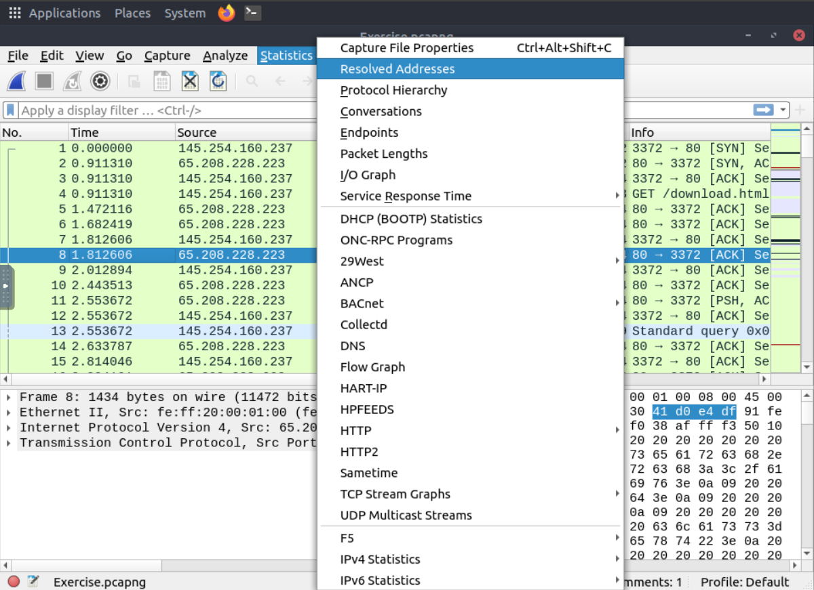
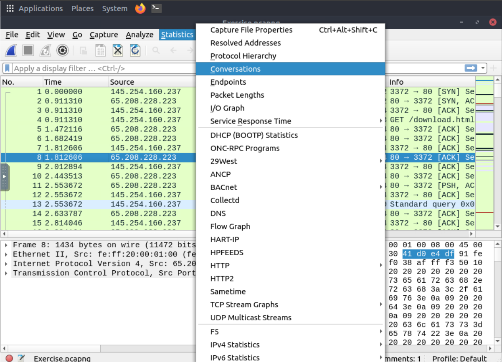
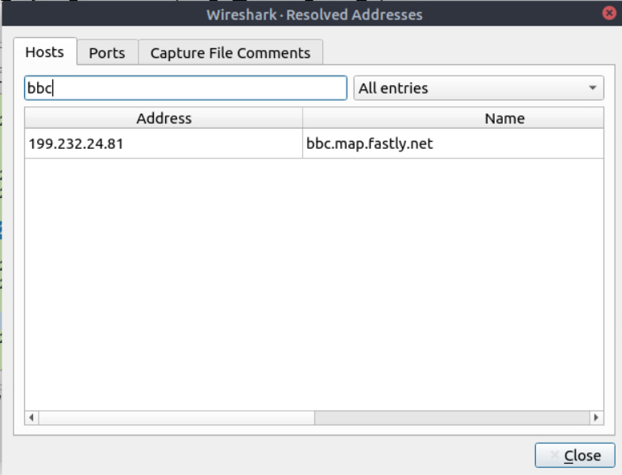

# Wireshark: Packet Operations

## Task 1 - Find the IP address of a specific host

Open **Statistics → Resolved Addresses**.

Search for the hostname.

The corresponding IP address will be displayed.

## Task 2 - View protocol conversations

Open:

Statistics → Conversations

This window displays all conversations grouped by protocol.

## Task 3 - Find the most active IP address

Open:

Statistics → Endpoints

Sort by **Rx Packets** or **Rx Bytes**.

